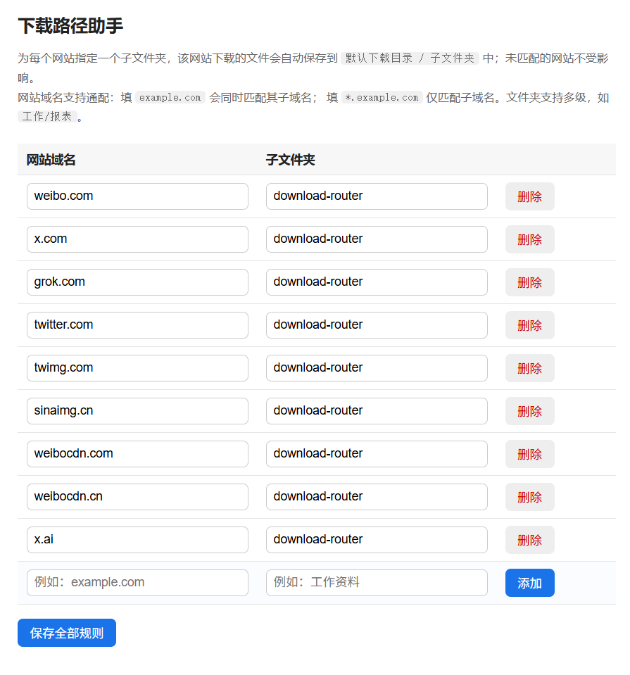

# 浏览器下载路径助手 (Download Router)

一个 Chrome 扩展：让**指定网站**下载的文件自动保存到默认下载目录下的**指定子文件夹**，其他网站不受影响。

## 工作原理

通过 `chrome.downloads.onDeterminingFilename` 事件，在浏览器确定下载文件名时，
若下载来源网站命中你的规则，就把文件名改写为 `子文件夹/原文件名`，
文件即落入 `默认下载目录/子文件夹/` 中。

> ⚠️ 限制说明：出于安全原因，Chrome 不允许扩展把文件保存到默认下载目录
> **之外**的任意路径，只能指定其下的子文件夹。如需完全自由的绝对路径，
> 需要额外安装 Native Messaging 本地组件（本扩展未包含）。

## 安装方法

1. 打开 Chrome，地址栏输入 `chrome://extensions/`
2. 打开右上角「开发者模式」
3. 点击「加载已解压的扩展程序」，选择本文件夹（`download-router`）
4. 点击工具栏上的扩展图标 →「管理规则」，添加规则

## 规则说明

- **网站域名**：填 `example.com` 会匹配其所有子域名（如 `a.example.com`）；
  填 `*.example.com` 只匹配子域名本身。
- **子文件夹**：相对于默认下载目录的路径，支持多级，如 `工作/报表`。
- 文件名冲突时自动加序号，不会覆盖已有文件。
- 扩展图标里的开关可一键停用/启用。

## 注意事项

- 请确保 Chrome 设置中「下载前询问每个文件的保存位置」处于**关闭**状态，
  否则每次下载仍会弹出保存对话框。
- 如果安装了其他同样接管下载文件名的扩展，两者可能冲突，请只保留一个。
- 规则通过 `chrome.storage.sync` 保存，会随 Chrome 账号同步。
